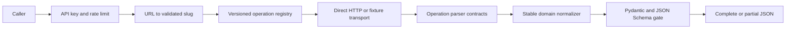

# Architecture

## Runtime flow

The caller-controlled URL ends at `canonicalizer.py`; it is never fetched. `transport.py` constructs the only live origin, `https://www.linkedin.com`, and obtains paths from the validated registry. GraphQL query IDs are environment lookups named by registry records.

## Volatility boundary

`config/operation_registry.yaml` carries semantic name, enabled state, evidence status, method, path, transport family, identifier environment name, variables, parser, observation time, viewer context, fixture, and evidence reference. Fixture mode accepts only `fixture_verified`; live mode accepts only `live_verified`. Enabled operations require observation metadata and fixtures. This converts upstream drift into an explicit configuration/parser lifecycle instead of scattering strings across application code.

## Core and sections

The core operation is sequential because it establishes identity. Enabled experience, education, skills, certifications, and languages operations then run concurrently with bounded connection-pool capacity. Core failure is an API error. Optional failure preserves core and successful sections, sets `partial=true`, and assigns `upstream_failed` or `parser_failed`. Disabled sections are `not_available_from_endpoint`; missing fields are never guessed to be viewer-hidden.

## Trust boundaries

- Caller: untrusted URL, request ID, and API key.
- Registry/schema: trusted only after strict startup validation.
- LinkedIn response: untrusted JSON with status, content-type, size, and parser checks.
- Secrets: environment/secret store only; excluded from models, logs, responses, fixtures, and Git.
- Output: Pydantic model followed by a separate Draft 2020-12 schema gate.

## Reliability

HTTPX uses pooling, a fixed origin, disabled redirects, explicit timeout, a streamed payload-size ceiling, and at most two configured retries. Only connect/read failures and 5xx responses retry. Auth expiry and challenge fail closed. No database, queue, Redis, worker fleet, browser, ML, or LLM is needed for this stateless workload.

## Known runtime boundary

All checked-in operations are synthetic fixture evidence. The direct HTTP adapter is contract-tested against mocked HTTP, not claimed as a current LinkedIn operation. Current live discovery is the remaining acquisition gate.

