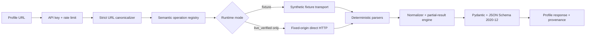

# Tross LinkedIn Profile API

**A browserless, evidence-gated research implementation for transforming a validated
LinkedIn member URL into a stable, provenance-carrying JSON profile.**

[](https://www.python.org/)
[](https://fastapi.tiangolo.com/)
[](RESULTS.md)
[](JUDGE_AUDIT.md)
[](LICENSE)

> [!IMPORTANT]
> The fixture/offline system is implemented and independently verified. The checked-in
> operations are `fixture_verified`, not evidence that LinkedIn currently serves the same
> private response shapes. Live mode therefore fails closed until every enabled operation
> has current, authorized replay evidence.

Production is deployed at <https://tross-linkedin-profile-api.vercel.app> in fail-closed
`live` mode. `/healthz` is available, `/readyz` reports 503, and profile requests return
`UPSTREAM_OPERATION_UNAVAILABLE` until a current live-verified core operation and owned
session are configured. Production does not return fixture profiles.

## Abstract

A LinkedIn profile is not a static record. What can be observed depends on the viewer,
authentication state, relationship, product entitlement, field-level visibility, and time.
Most profile-extraction interfaces erase this uncertainty by returning values or `null`.
Tross instead models extraction as a time-bound observation and attaches availability,
source operation, and observation provenance to every supported field.

The implementation separates volatile upstream operations from stable application logic
through a semantic registry. It uses direct HTTP requests to a fixed LinkedIn origin and
contains no browser automation, DOM parsing, screenshot extraction, CAPTCHA solving,
proxy rotation, or fingerprint spoofing. A checkpoint or authorization failure makes the
session unavailable and requires manual operator action.

The current release demonstrates the architecture, contract, security boundary, partial
result behavior, and evaluation method against synthetic fixtures. It deliberately does
not claim live LinkedIn correctness, production safety, or legal authorization.

## Research question

> Can a profile-by-URL API remain useful while making upstream uncertainty, operation
> drift, partial failure, and evidence quality explicit?

The design follows four conclusions from the supplied research corpus:

1. Official member APIs are important baselines but do not provide unrestricted rich
   third-party profile lookup by arbitrary URL.
2. Private web operations are volatile observations, not permanent endpoints.
3. `absent`, `hidden`, `not_loaded`, `unavailable`, and `extraction_failed` are
   different states and must not collapse into one `null`.
4. Compliance and account risk cannot be solved with anti-detection engineering; the
   system must fail closed and preserve an auditable evidence boundary.

See the [research synthesis](02_RESEARCH_AND_REVERSE_ENGINEERING/RESEARCH_SYNTHESIS.md),
[consolidated research backbone](02_RESEARCH_AND_REVERSE_ENGINEERING/CONSOLIDATED_RESEARCH_BACKBONE.md),
and [source-of-truth hierarchy](00_START_HERE/SOURCE_OF_TRUTH.md).

## Contributions

- **Evidence-gated operation registry.** Business logic refers to semantic operations;
  query identifiers, evidence dates, fixtures, and verification status live in one registry.
- **Provenance-first response model.** Twelve profile fields carry availability and source
  metadata rather than ambiguous missing values.
- **Fail-closed live activation.** Fixture or historical operations cannot start in live
  mode; missing session values or current query identifiers are startup errors.
- **Deterministic partial-result engine.** Optional section failure returns a valid partial
  response without silently corrupting successful sections.
- **Independent fixture evaluation.** Expected answers are checked in separately from raw
  upstream-shaped fixtures and are never generated from extractor output.
- **No-browser runtime boundary.** Production dependencies and source are scanned for
  browser, DOM, and prohibited evasion mechanisms.

## System model



The API surface is intentionally small:

| Route | Authentication | Purpose |
|---|---|---|
| `GET /healthz` | none | Process liveness |
| `GET /readyz` | none | Configuration and registry readiness |
| `GET /v1/profiles?url=...` | `X-API-Key` | Normalize one LinkedIn member URL |
| `GET /openapi.json` | none | OpenAPI 3.1 contract |
| `GET /docs` | none | Interactive API documentation |

Full request, response, status, and error semantics are in the
[API reference](API_REFERENCE.md).

## Evidence model

| Evidence class | Meaning | Permitted claim |
|---|---|---|
| `fixture_verified` | Parser and pipeline tested against synthetic upstream-shaped data | Offline correctness only |
| `historical_reference` | Useful prior observation without current replay | Research/reference only |
| `live_verified` | Current authorized capture, direct replay, redacted fixture, and contract test | Eligible for live runtime |
| `unknown` | No adequate evidence | No operational claim |

Only `live_verified` operations may be enabled in live mode. The checked-in registry
contains six fixture-verified operations and zero live-verified operations.

## Verified results

Evidence date: **2026-08-27**. Evidence class: **`fixture_verified`**.

| Verification gate | Result | Scope |
|---|---:|---|
| Test suite | 54 passed | Unit, integration, schema, drift, security |
| Ruff | Pass | Production, tests, scripts |
| mypy strict | Pass | 18 production modules |
| Primitive-field correctness | 4/4 | One synthetic profile |
| Nested-entry recall | 8/8 | One synthetic profile |
| Availability-status accuracy | 12/12 | One synthetic profile |
| Provenance coverage | 12/12 | One synthetic profile |
| Browser production dependencies | 0 | Manifest and source scan |
| Dependency vulnerabilities | 0 known | `pip-audit`; local package excluded from PyPI lookup |
| Clean-clone verification | Pass | Install, test, benchmark, security scan |
| Container smoke test | Pass | Health and authenticated fixture request |

Fixture measurements are not live extraction metrics. No controlled-live dataset,
LinkedIn operation replay, public HTTPS evaluator run, or independent PhantomBuster run
was available. Those results remain `unknown`, not zero and not pass. See
[results](RESULTS.md), [limitations](LIMITATIONS.md), and the
[adversarial judge audit](JUDGE_AUDIT.md).

## Reproduce locally

Requirements: Git, [uv](https://docs.astral.sh/uv/), and Python 3.12+.

```bash
git clone https://github.com/Shoryamishra61/tross-linkedin-profile-api.git
cd tross-linkedin-profile-api
uv sync --extra dev --locked --python 3.12
```

Generate a local API key and start the deterministic fixture service.

PowerShell:

```powershell
$env:APP_API_KEYS = uv run python -c "import secrets; print(secrets.token_urlsafe(32))"
$env:APP_MODE = "fixture"
uv run uvicorn tross_linkedin_api.main:app --host 127.0.0.1 --port 8000
```

Bash:

```bash
export APP_API_KEYS="$(uv run python -c 'import secrets; print(secrets.token_urlsafe(32))')"
export APP_MODE=fixture
uv run uvicorn tross_linkedin_api.main:app --host 127.0.0.1 --port 8000
```

Then call the synthetic profile from another shell, substituting the generated key:

```bash
curl http://127.0.0.1:8000/healthz
curl http://127.0.0.1:8000/readyz
curl -H "X-API-Key: YOUR_GENERATED_KEY" \
  "http://127.0.0.1:8000/v1/profiles?url=https%3A%2F%2Fwww.linkedin.com%2Fin%2Fsynthetic-profile"
```

Run the complete verification suite:

```bash
uv run ruff check src tests scripts
uv run mypy
uv run pytest
uv run python scripts/security_audit.py
uv run tross-benchmark --json --iterations 10
uv run pip-audit
docker build -t tross-linkedin-profile-api:local .
```

The [reproducibility guide](REPRODUCIBILITY.md) explains the clean-room and
independence checks.

## Deploy to Vercel

[](https://vercel.com/new/clone?repository-url=https%3A%2F%2Fgithub.com%2FShoryamishra61%2Ftross-linkedin-profile-api&env=APP_API_KEYS,APP_MODE&envDescription=Generate%20a%20random%20API%20key.%20Use%20fixture%20mode%20until%20all%20live%20operations%20are%20currently%20verified.&envLink=https%3A%2F%2Fgithub.com%2FShoryamishra61%2Ftross-linkedin-profile-api%23evidence-model)

Vercel loads the FastAPI ASGI application through the entrypoint declared in
`pyproject.toml`. For an honest public demonstration, configure:

- `APP_MODE=fixture`
- `APP_API_KEYS=<a newly generated random key>`

After deployment, verify `/healthz`, `/readyz`, `/openapi.json`, and an
authenticated request to `/v1/profiles`. This deployment demonstrates the complete
synthetic-fixture pipeline; it is not a live LinkedIn extraction claim.

Do not set `APP_MODE=live` until the [live activation protocol](#live-activation-protocol)
is complete and all LinkedIn secrets and current query identifiers are stored in Vercel's
encrypted environment settings.

## Live activation protocol

Do not enable live mode by copying historical routes or guessing query identifiers.
Follow the [reverse-engineering method](REVERSE_ENGINEERING_METHOD.md) using an owned,
authorized account. For each semantic operation:

1. capture only the minimum redacted request semantics;
2. replay through direct HTTP without bypass behavior;
3. add a redacted fixture and parser contract tests;
4. record `observed_at`, an evidence reference, and `live_verified` status;
5. inject session values and current query identifiers outside Git;
6. start with `APP_MODE=live` and exercise readiness before traffic.

The runtime rejects an enabled GraphQL operation when its query-identifier environment
value is missing. A 401, 403, or recognized checkpoint suspends the session; automated
challenge solving is outside the design.

## Repository guide

| Path | Contents |
|---|---|
| `00_START_HERE/` | Precedence, audit, inventory, contributor instructions |
| `01_PRODUCT_AND_REQUIREMENTS/` | PRD, requirements, SRS, traceability |
| `02_RESEARCH_AND_REVERSE_ENGINEERING/` | Research corpus, evidence policy, protocol |
| `03_ARCHITECTURE_AND_DESIGN/` | System design, decisions, failure model |
| `04_API_AND_DATA_CONTRACTS/` | API, model, and operation-registry contracts |
| `05_SECURITY_PRIVACY_RELIABILITY/` | Threat, privacy, and SRE analysis |
| `06_TESTING_AND_EVALUATION/` | Test and benchmark methodology |
| `07_IMPLEMENTATION_AND_RELEASE/` | Build, migration, deployment, Definition of Done |
| `08_JUDGE_AND_DEMO/` | Demo plan and adversarial review framework |
| `09_AGENT_PROMPTS/` | Preserved execution prompts |
| `10_REFERENCE_DATA/` | Audited link inventories |
| `11_ARCHIVE_ORIGINALS/` | Supplied historical artifacts, preserved unchanged |
| `src/`, `tests/`, `schemas/`, `config/` | Executable implementation and contracts |

Final evidence documents:

- [Architecture](ARCHITECTURE.md) · [API reference](API_REFERENCE.md) ·
  [Security](SECURITY.md)
- [Research method](REVERSE_ENGINEERING_METHOD.md) ·
  [PhantomBuster comparison](PHANTOMBUSTER_COMPARISON.md) ·
  [Privacy and platform notes](PRIVACY_AND_PLATFORM_NOTES.md)
- [Results](RESULTS.md) · [Limitations](LIMITATIONS.md) ·
  [Reproducibility](REPRODUCIBILITY.md)
- [Build log](BUILD_LOG.md) · [Failure log](FAILURE_LOG.md) ·
  [Assumption register](ASSUMPTION_REGISTER.md)
- [Demo](DEMO.md) · [Adversarial judge audit](JUDGE_AUDIT.md)

## Responsible-use boundary

This repository is research software, not permission to collect personal data. LinkedIn's
terms, privacy law, contractual obligations, and authorization requirements apply
independently of technical feasibility. Use only accounts and profiles you are authorized
to test, minimize retained data, never commit session credentials, and stop on restriction
or checkpoint signals. See [privacy and platform notes](PRIVACY_AND_PLATFORM_NOTES.md)
and [security](SECURITY.md).

## Project status

- Offline research implementation: **complete and verified**
- Public source release: **available**
- Live LinkedIn operations: **blocked pending current authorized evidence**
- Public API deployment: **online in fail-closed live mode; extraction unavailable pending live evidence**

The exact open gates and evidence are maintained in [JUDGE_AUDIT.md](JUDGE_AUDIT.md).

## License

Released under the [MIT License](LICENSE). Legal and platform-risk notes are informational
and are not legal advice.
